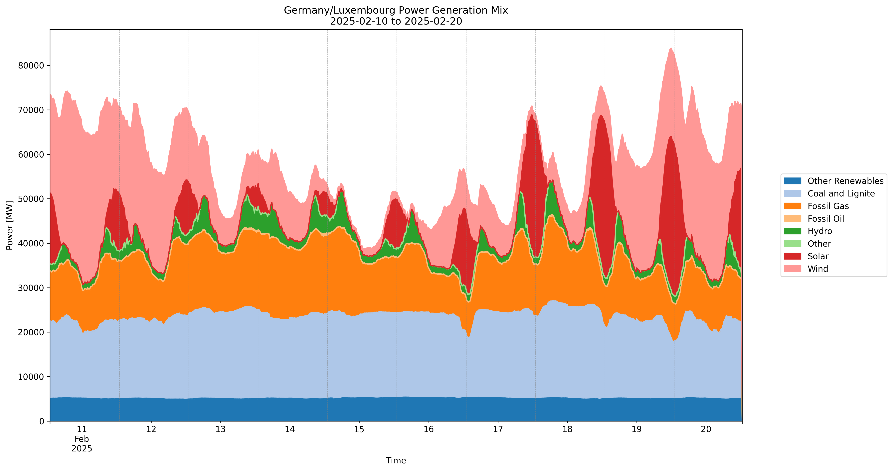
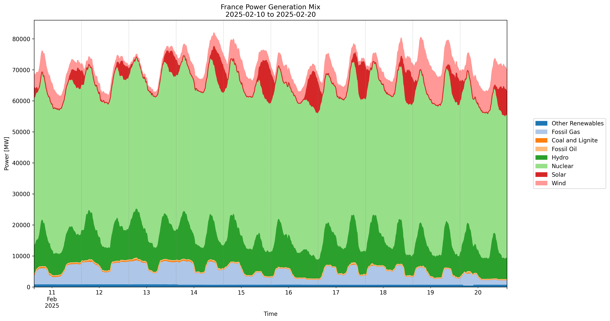
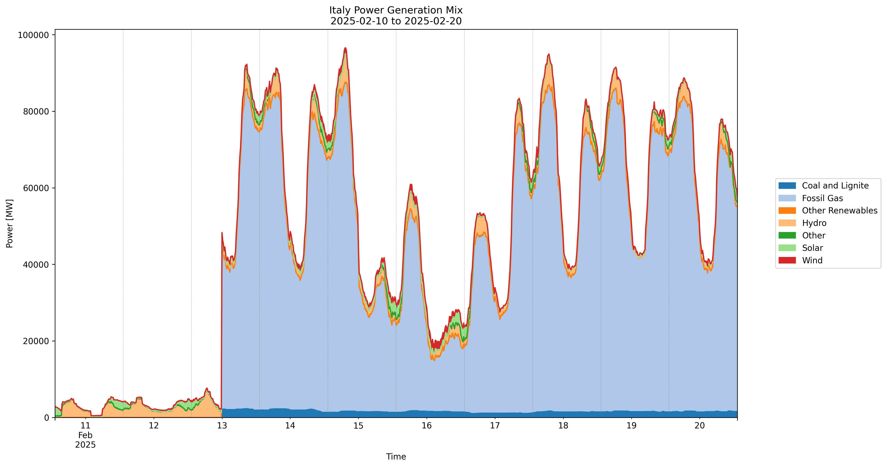
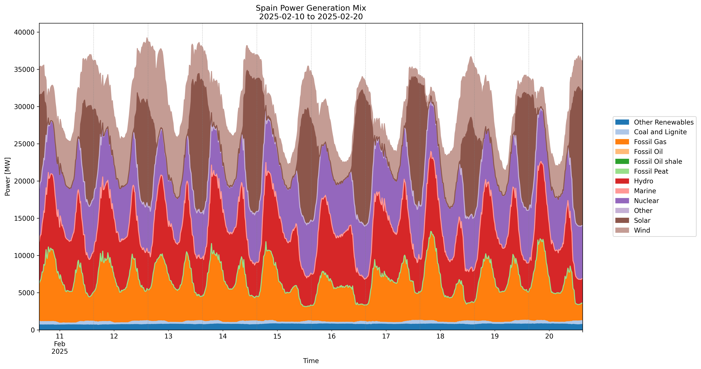

# European Energy Analysis Tools

A comprehensive analysis suite for European power systems, combining generation mix analysis and renewable infrastructure mapping.

## Overview

This project provides tools for analyzing European energy systems through two main components:
1. Power generation mix analysis using ENTSO-E data
2. Interactive mapping of renewable energy installations

## Power Generation Analysis

### Generation Mix Visualizations

#### Germany/Luxembourg


Key characteristics:
- Strong wind power contribution (pink), showing Germany's leadership in wind energy deployment
- Significant solar generation (red), demonstrating successful photovoltaic integration
- Substantial coal and lignite baseload (light blue)
- Flexible gas generation (orange) balancing renewable variability
- Clear daily patterns in solar generation with peak production during midday hours

#### France


Notable features:
- Dominant nuclear baseload (green), reflecting France's strategic focus on nuclear power
- Complementary wind and solar generation
- Limited fossil fuel usage
- Hydro power providing flexibility
- Demonstrating one of Europe's lowest-carbon electricity systems

#### Italy


System characteristics:
- Heavy reliance on natural gas (light blue)
- Growing renewable energy penetration
- Notable solar contribution during daylight hours
- Limited baseload capacity
- Clear daily demand patterns with evening peaks

#### Spain


Key aspects:
- Diverse generation mix with strong renewable presence
- Significant wind power contribution
- Notable nuclear baseload
- Solar generation showing Mediterranean potential
- Hydro and gas providing system flexibility

### Analysis Insights

- **Complementary Patterns**: Wind and solar generation often complement each other across regions
- **Regional Differences**: Clear contrast between nuclear-dominated (France) and gas-dominated (Italy) systems
- **Renewable Integration**: All countries show successful integration of variable renewable energy
- **Flexibility Solutions**: Different approaches to system flexibility (hydro, gas, interconnection)

## Renewable Power Plants Map

The project includes an interactive map visualizing wind and solar installations across Europe.

### Accessing the Interactive Map
1. Clone the repository
2. Navigate to `renewable_plants_map.html`
3. Open in a web browser to explore the interactive features

### Map Features
- Custom icons for wind and solar installations
- Cluster visualization for dense areas
- Detailed installation information on click
- Layer controls for filtering by country and technology
- Capacity visualization through marker sizing

### Using the Interactive Map
1. **Navigation**: Zoom and pan to explore different regions
2. **Filtering**: Use layer control to show/hide specific countries or technologies
3. **Details**: Click on installations to view:
   - Installed capacity
   - Commission year
   - Plant name and type
4. **Clustering**: Markers automatically cluster at higher zoom levels

## Installation and Usage

1. Clone the repository:
```bash
git clone https://github.com/yourusername/EuropeanEnergyAnalysis.git
cd EuropeanEnergyAnalysis
```

2. Install dependencies:
```bash
pip install -r requirements.txt
```

3. Set up ENTSO-E API key:
```bash
export ENTSOE_API_KEY='your-api-key'
```

4. Run the analysis:
```bash
# For generation mix analysis
python src/power_generation/ENTSOE_EuropeanEnergyBySource.py

# For renewable plants map
python src/power_plants/renewable_map.py
```

## Technical Implementation

### Power Generation Analysis
- Real-time data fetching from ENTSO-E API
- Automated data processing and cleaning
- Dynamic visualization generation
- Multi-country synchronous analysis

### Renewable Plants Map
- Integration with Global Power Plant Database
- Custom icon implementation
- Interactive clustering algorithm
- Responsive design for various screen sizes

## Future Enhancements

1. **Analysis Expansion**
   - Price correlation analysis
   - Cross-border flow integration
   - Weather data correlation

2. **Visualization Improvements**
   - Additional chart types
   - Interactive time selection
   - Enhanced map features

3. **Data Integration**
   - Historical trend analysis
   - Forecasting capabilities
   - Additional data sources

## Author

Antonio Pavoni

## License

This project is licensed under the MIT License - see the LICENSE file for details.

## Acknowledgments

- ENTSO-E for providing the Transparency Platform API
- World Resources Institute for the Global Power Plant Database
- OpenStreetMap for map data
- Various open-source libraries used in this project
